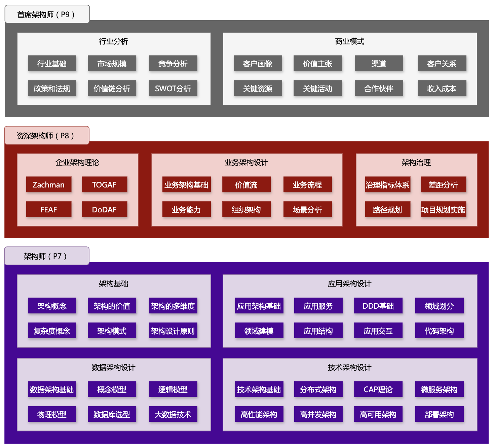

欢迎右上角 **「Star ⭐️ 」** 和 **「Fork」**，这是对我最大的鼓励和支持。

## 架构学习路线图

很多读者经常抱怨，工作中涉及不到太多架构设计，对于架构的理解少之又少。

零散地做过一些架构工作，但完全不知道架构设计的全流程是怎样的。

想要成长为架构师，缺乏系统的方法论指导。

无论是程序员，还是产品经理，想要持续成长，绕不开架构能力，有时架构能力就像鸿沟一样，挡在晋升和求职之路上，只要跨过去，就能打开职业天花板，拓宽发展道路。

基于我10多年的架构经验，进行体系化梳理后，整理出了最全架构学习路线图。

## 各职级的核心区别

- 初级程序员（P4）：掌握编程基础，在指导下完成研发任务。
- 高级程序员（P5）：技术扎实，高效完成研发任务。
- 资深程序员（P6）：独挡一面，能够解决复杂技术难题。
- 架构师（P7）：体系化的系统设计能力，垂直领域架构经验，大型项目管理经验。
- 资深架构师（P8）：具备业务思维，多领域架构经验，跨团队协作和领导。
- 首席架构师（P9）：能洞察行业趋势，具备商业思维，企业级系统架构经验。

## 架构学习路线目录

> 没链接的，耐心等待更新哟~

### 数据结构与算法

- 数据结构：[数组](https://tangshiye.cn/02.%E7%AE%97%E6%B3%95/01.%20%E6%95%B0%E7%BB%84/01.%20%E6%95%B0%E7%BB%84%E5%9F%BA%E7%A1%80%E7%9F%A5%E8%AF%86/01.%20%E6%95%B0%E7%BB%84%E5%9F%BA%E7%A1%80%E7%9F%A5%E8%AF%86.html) | [链表](https://tangshiye.cn/02.%E7%AE%97%E6%B3%95/02.%20%E9%93%BE%E8%A1%A8/01.%20%E9%93%BE%E8%A1%A8%E5%9F%BA%E7%A1%80%E7%9F%A5%E8%AF%86/01.%20%E9%93%BE%E8%A1%A8%E5%9F%BA%E7%A1%80%E7%9F%A5%E8%AF%86.html) | [堆栈](https://tangshiye.cn/02.%E7%AE%97%E6%B3%95/03.%20%E5%A0%86%E6%A0%88/01.%20%E5%A0%86%E6%A0%88%E5%9F%BA%E7%A1%80%E7%9F%A5%E8%AF%86/01.%20%E5%A0%86%E6%A0%88%E5%9F%BA%E7%A1%80%E7%9F%A5%E8%AF%86.html) | [队列](https://tangshiye.cn/02.%E7%AE%97%E6%B3%95/04.%20%E9%98%9F%E5%88%97/01.%20%E9%98%9F%E5%88%97%E5%9F%BA%E7%A1%80%E7%9F%A5%E8%AF%86/01.%20%E9%98%9F%E5%88%97%E5%9F%BA%E7%A1%80%E7%9F%A5%E8%AF%86.html) | [哈希表](https://tangshiye.cn/02.%E7%AE%97%E6%B3%95/05.%20%E5%93%88%E5%B8%8C%E8%A1%A8/01.%20%E5%93%88%E5%B8%8C%E8%A1%A8%E7%9F%A5%E8%AF%86.html) | [字符串](https://tangshiye.cn/02.%E7%AE%97%E6%B3%95/06.%20%E5%AD%97%E7%AC%A6%E4%B8%B2/01.%20%E5%AD%97%E7%AC%A6%E4%B8%B2%E5%9F%BA%E7%A1%80%E7%9F%A5%E8%AF%86/01.%20%E5%AD%97%E7%AC%A6%E4%B8%B2%E5%9F%BA%E7%A1%80%E7%9F%A5%E8%AF%86.html) | [树](https://tangshiye.cn/02.%E7%AE%97%E6%B3%95/07.%20%E6%A0%91/01.%20%E4%BA%8C%E5%8F%89%E6%A0%91/01.%20%E6%A0%91%E4%B8%8E%E4%BA%8C%E5%8F%89%E6%A0%91%E7%9A%84%E5%9F%BA%E7%A1%80%E7%9F%A5%E8%AF%86.html) | [图](https://tangshiye.cn/02.%E7%AE%97%E6%B3%95/08.%20%E5%9B%BE/01.%20%E5%9B%BE%E7%9A%84%E5%9F%BA%E7%A1%80%E7%9F%A5%E8%AF%86/01.%20%E5%9B%BE%E7%9A%84%E5%AE%9A%E4%B9%89%E5%92%8C%E5%88%86%E7%B1%BB.html)
- 算法思想：[分治算法](https://tangshiye.cn/02.%E7%AE%97%E6%B3%95/09.%20%E5%9F%BA%E7%A1%80%E7%AE%97%E6%B3%95/03.%20%E5%88%86%E6%B2%BB%E7%AE%97%E6%B3%95/01.%20%E5%88%86%E6%B2%BB%E7%AE%97%E6%B3%95%E7%9F%A5%E8%AF%86.html) | [递归算法](https://tangshiye.cn/02.%E7%AE%97%E6%B3%95/09.%20%E5%9F%BA%E7%A1%80%E7%AE%97%E6%B3%95/02.%20%E9%80%92%E5%BD%92%E7%AE%97%E6%B3%95/01.%20%E9%80%92%E5%BD%92%E7%AE%97%E6%B3%95%E7%9F%A5%E8%AF%86.html) | [回溯算法](https://tangshiye.cn/02.%E7%AE%97%E6%B3%95/09.%20%E5%9F%BA%E7%A1%80%E7%AE%97%E6%B3%95/04.%20%E5%9B%9E%E6%BA%AF%E7%AE%97%E6%B3%95/01.%20%E5%9B%9E%E6%BA%AF%E7%AE%97%E6%B3%95%E7%9F%A5%E8%AF%86.html) | [贪心算法](https://tangshiye.cn/02.%E7%AE%97%E6%B3%95/09.%20%E5%9F%BA%E7%A1%80%E7%AE%97%E6%B3%95/05.%20%E8%B4%AA%E5%BF%83%E7%AE%97%E6%B3%95/01.%20%E8%B4%AA%E5%BF%83%E7%AE%97%E6%B3%95%E7%9F%A5%E8%AF%86.html) | [动态规划](https://tangshiye.cn/02.%E7%AE%97%E6%B3%95/10.%20%E5%8A%A8%E6%80%81%E8%A7%84%E5%88%92/01.%20%E5%8A%A8%E6%80%81%E8%A7%84%E5%88%92%E5%9F%BA%E7%A1%80/01.%20%E5%8A%A8%E6%80%81%E8%A7%84%E5%88%92%E5%9F%BA%E7%A1%80%E7%9F%A5%E8%AF%86.html)

### 编程语言基础

- Java编程：[面向对象](https://tangshiye.cn/01.Java/01.Java%E5%9F%BA%E7%A1%80/01.%E9%9D%A2%E5%90%91%E5%AF%B9%E8%B1%A1.html) | [集合框架](https://tangshiye.cn/01.Java/02.Java%E9%9B%86%E5%90%88%E6%A1%86%E6%9E%B6/01.%E6%A6%82%E8%A7%88.html) | [多线程与并发](https://tangshiye.cn/01.Java/03.Java%E5%A4%9A%E7%BA%BF%E7%A8%8B%E4%B8%8E%E5%B9%B6%E5%8F%91/01.%E5%B9%B6%E5%8F%91%E7%BC%96%E7%A8%8B%E7%9A%84%E4%BC%98%E7%BC%BA%E7%82%B9.html) | [JVM相关](https://tangshiye.cn/01.Java/04.JVM%E7%9B%B8%E5%85%B3/01.JVM%E5%86%85%E5%AD%98%E7%BB%93%E6%9E%84.html) | [Netty](https://tangshiye.cn/01.Java/06.Netty/01.netty%E5%85%A5%E9%97%A8%EF%BC%88%E4%B8%80%EF%BC%89%20netty%E4%BB%8B%E7%BB%8D.html) 

### 开发必备框架与工具

- 数据库：数据库基础  | [Mysql](https://tangshiye.cn/03.%E6%95%B0%E6%8D%AE%E5%BA%93/01.Mysql%E8%AF%A6%E8%A7%A3/)  | [Hbase](https://tangshiye.cn/03.%E6%95%B0%E6%8D%AE%E5%BA%93/03.Hbase%E8%AF%A6%E8%A7%A3/01.HBase%E6%9E%B6%E6%9E%84.html) | [分库分表](https://tangshiye.cn/04.%E6%A1%86%E6%9E%B6%E4%B8%8E%E4%B8%AD%E9%97%B4%E4%BB%B6/10.Sharding-JDBC/)
- 核心框架：常用工具类 | [Spring](https://tangshiye.cn/04.%E6%A1%86%E6%9E%B6%E4%B8%8E%E4%B8%AD%E9%97%B4%E4%BB%B6/01.Spring/) | [SpringBoot](https://tangshiye.cn/04.%E6%A1%86%E6%9E%B6%E4%B8%8E%E4%B8%AD%E9%97%B4%E4%BB%B6/03.SpringBoot/) | [SpringMVC](https://tangshiye.cn/04.%E6%A1%86%E6%9E%B6%E4%B8%8E%E4%B8%AD%E9%97%B4%E4%BB%B6/02.SpringMVC/) | [ORM框架](https://tangshiye.cn/04.%E6%A1%86%E6%9E%B6%E4%B8%8E%E4%B8%AD%E9%97%B4%E4%BB%B6/09.Mybatis/)
- 设计模式：[创建型](https://tangshiye.cn/01.Java/05.%E8%AE%BE%E8%AE%A1%E6%A8%A1%E5%BC%8F/) | [行为型](https://tangshiye.cn/01.Java/05.%E8%AE%BE%E8%AE%A1%E6%A8%A1%E5%BC%8F/) | [结构型](https://tangshiye.cn/01.Java/05.%E8%AE%BE%E8%AE%A1%E6%A8%A1%E5%BC%8F/)
- 开发工具&部署：Git | IDE | CI/CD | tomcat | Linux | Docker
- 开发规范：[技术方案规范](https://tangshiye.cn/07.%E5%BC%80%E5%8F%91%E8%A7%84%E8%8C%83/01.%E6%8A%80%E6%9C%AF%E6%96%B9%E6%A1%88%E6%A8%A1%E6%9D%BF.html) | 阿里开发手册

### 中间件与系统调优

- 缓存：[Redis](https://tangshiye.cn/03.%E6%95%B0%E6%8D%AE%E5%BA%93/02.Redis%E8%AF%A6%E8%A7%A3/) | Memcached
- RPC框架：[dubbo](https://tangshiye.cn/04.%E6%A1%86%E6%9E%B6%E4%B8%8E%E4%B8%AD%E9%97%B4%E4%BB%B6/06.Dubbo)
- 消息中间件：[Kafka](https://tangshiye.cn/04.%E6%A1%86%E6%9E%B6%E4%B8%8E%E4%B8%AD%E9%97%B4%E4%BB%B6/07.Kafka/) | [RocketMQ](https://tangshiye.cn/04.%E6%A1%86%E6%9E%B6%E4%B8%8E%E4%B8%AD%E9%97%B4%E4%BB%B6/08.RocketMQ/)
- 搜索：[Elasticsearch](https://tangshiye.cn/03.%E6%95%B0%E6%8D%AE%E5%BA%93/04.Elasticsearch/)
- 工作流：Activiti
- 规则引擎：Drools | Easy Rules
- 系统调优：性能调优 | JVM调优 | 数据库调优 | 日志与监控

### 安全技术

- 身份认证与授权：单点登录（SSO）| [OAuth 2.0](https://tangshiye.cn/04.%E6%A1%86%E6%9E%B6%E4%B8%8E%E4%B8%AD%E9%97%B4%E4%BB%B6/11.OAuth2/) | [SpringSecurity](https://tangshiye.cn/04.%E6%A1%86%E6%9E%B6%E4%B8%8E%E4%B8%AD%E9%97%B4%E4%BB%B6/05.SpringSecurity/)
- 数据加密与解密：对称加密算法（如AES、DES） | 非对称加密算法（如RSA、ECC） | 哈希算法（如SHA-256、MD5） | 数字签名公钥基础设施（PKI） | SSL/TLS协议 数据库加密
- 网络安全：DDoS攻击防护 | DNS安全（如DNSSEC）
- 应用安全：安全编码实践 | 代码注入防护（如SQL注入、XSS）| 安全日志记录与审计 | API安全（如API网关、令牌管理）

### 架构基础

- [什么是架构？](https://tangshiye.cn/05.%E6%9E%B6%E6%9E%84%E8%AE%BE%E8%AE%A1/01.%E4%B8%80%E6%96%87%E6%90%9E%E6%87%82%E4%BB%80%E4%B9%88%E6%98%AF%E6%9E%B6%E6%9E%84.html)
- [架构有什么价值？](https://tangshiye.cn/05.%E6%9E%B6%E6%9E%84%E8%AE%BE%E8%AE%A1/02.%E4%B8%80%E6%96%87%E6%90%9E%E6%87%82%E6%9E%B6%E6%9E%84%E8%AE%BE%E8%AE%A1%E7%9A%84%E7%9B%AE%E7%9A%84.html)
- [架构多维度](https://tangshiye.cn/05.%E6%9E%B6%E6%9E%84%E8%AE%BE%E8%AE%A1/03.%E4%BB%8E%E5%A4%9A%E7%BB%B4%E5%BA%A6%E7%90%86%E8%A7%A3%E6%9E%B6%E6%9E%84.html)
- 架构模式
- 复杂度概念
- 架构设计原则
- 架构师成长：[架构师的种类](https://tangshiye.cn/05.%E6%9E%B6%E6%9E%84%E8%AE%BE%E8%AE%A1/99.%E6%9E%B6%E6%9E%84%E5%B8%88%E6%88%90%E9%95%BF%E8%B7%AF%E7%BA%BF.html) | [架构师的5点底层能力](https://tangshiye.cn/05.%E6%9E%B6%E6%9E%84%E8%AE%BE%E8%AE%A1/11.%E6%9E%B6%E6%9E%84%E5%B8%88%E6%88%90%E9%95%BF/02.%E6%9E%B6%E6%9E%84%E5%B8%88%E7%9A%845%E7%82%B9%E5%BA%95%E5%B1%82%E8%83%BD%E5%8A%9B.html)

### 应用架构设计

- 应用架构：[应用架构基础](https://tangshiye.cn/05.%E6%9E%B6%E6%9E%84%E8%AE%BE%E8%AE%A1/05.%E5%BA%94%E7%94%A8%E6%9E%B6%E6%9E%84%E7%9A%84%E6%A0%B8%E5%BF%83%E6%A6%82%E5%BF%B5.html) | 应用服务 | 应用结构 | 应用交互
- DDD（领域驱动设计）：基于DDD的应用架构 | 领域、子域、核心域、通用域、支撑域 | 限界上下文 | 实体和值对象 | 聚合和聚合根 | 领域事件 | DDD分层 | DDD与微服务划分 | DDD代码模型

### 数据架构设计

- 数据模型：概念模型 | 逻辑模型 | 物理模型
- 数据库技术选型
- 大数据技术

### 技术架构设计

- 分布式架构设计：[分布式调度](https://tangshiye.cn/04.%E6%A1%86%E6%9E%B6%E4%B8%8E%E4%B8%AD%E9%97%B4%E4%BB%B6/12.XXL-JOB/) | [分布式事务](https://tangshiye.cn/05.%E6%9E%B6%E6%9E%84%E8%AE%BE%E8%AE%A1/05.%E5%88%86%E5%B8%83%E5%BC%8F%E4%BA%8B%E5%8A%A1/)

- 高并发、高性能、高可用：

- 微服务架构：[SpringCloud](https://tangshiye.cn/04.%E6%A1%86%E6%9E%B6%E4%B8%8E%E4%B8%AD%E9%97%B4%E4%BB%B6/04.SpringCloud/)

### 业务架构设计

- 业务架构：[业务架构基础](https://tangshiye.cn/05.%E6%9E%B6%E6%9E%84%E8%AE%BE%E8%AE%A1/04.%E4%B8%9A%E5%8A%A1%E6%9E%B6%E6%9E%84%E7%9A%84%E6%A0%B8%E5%BF%83%E6%A6%82%E5%BF%B5.html) | [价值流](https://tangshiye.cn/05.%E6%9E%B6%E6%9E%84%E8%AE%BE%E8%AE%A1/11.%E6%9E%B6%E6%9E%84%E5%B8%88%E6%88%90%E9%95%BF/02.%E6%9E%B6%E6%9E%84%E5%B8%88%E7%9A%845%E7%82%B9%E5%BA%95%E5%B1%82%E8%83%BD%E5%8A%9B.html) | 业务流程 | 业务能力 | 业务场景 | 组织架构

### 架构治理

- 企业架构：Zachman | TOGAF | FEAF | DoDAF | eTOM | ArchiMate | Gartner
- 架构治理：治理指标体系 | 差距分析 | 路径规划 | 项目规划实施

## 架构学习资料

### 系统架构案例

- [01.新零售SaaS系统规划](https://tangshiye.cn/06.%E7%B3%BB%E7%BB%9F%E6%A1%88%E4%BE%8B/01.%E6%96%B0%E9%9B%B6%E5%94%AESaaS%E7%B3%BB%E7%BB%9F%E8%A7%84%E5%88%92.html)
- [02.多渠道概念模型设计](https://tangshiye.cn/06.%E7%B3%BB%E7%BB%9F%E6%A1%88%E4%BE%8B/02.%E5%A4%9A%E6%B8%A0%E9%81%93%E6%A6%82%E5%BF%B5%E6%A8%A1%E5%9E%8B%E8%AE%BE%E8%AE%A1.html)
- [03.组织管理架构设计](https://tangshiye.cn/06.%E7%B3%BB%E7%BB%9F%E6%A1%88%E4%BE%8B/03.%E7%BB%84%E7%BB%87%E7%AE%A1%E7%90%86%E6%9E%B6%E6%9E%84%E8%AE%BE%E8%AE%A1.html)
- [04.商品管理系统架构设计](https://tangshiye.cn/06.%E7%B3%BB%E7%BB%9F%E6%A1%88%E4%BE%8B/04.%E5%95%86%E5%93%81%E7%AE%A1%E7%90%86%E7%B3%BB%E7%BB%9F%E6%9E%B6%E6%9E%84%E8%AE%BE%E8%AE%A1.html)
- [05.中央库存系统架构设计](https://tangshiye.cn/06.%E7%B3%BB%E7%BB%9F%E6%A1%88%E4%BE%8B/05.%E4%B8%AD%E5%A4%AE%E5%BA%93%E5%AD%98%E7%B3%BB%E7%BB%9F%E6%9E%B6%E6%9E%84%E8%AE%BE%E8%AE%A1.html)
- [06.线上商城系统架构设计](https://tangshiye.cn/06.%E7%B3%BB%E7%BB%9F%E6%A1%88%E4%BE%8B/06.%E7%BA%BF%E4%B8%8A%E5%95%86%E5%9F%8E%E7%B3%BB%E7%BB%9F%E6%9E%B6%E6%9E%84%E8%AE%BE%E8%AE%A1.html)
- [07.促销系统架构设计](https://tangshiye.cn/06.%E7%B3%BB%E7%BB%9F%E6%A1%88%E4%BE%8B/07.%E4%BF%83%E9%94%80%E7%B3%BB%E7%BB%9F%E6%9E%B6%E6%9E%84%E8%AE%BE%E8%AE%A1.html)
- [08.订单履约系统架构设计](https://tangshiye.cn/06.%E7%B3%BB%E7%BB%9F%E6%A1%88%E4%BE%8B/08.%E8%AE%A2%E5%8D%95%E5%B1%A5%E7%BA%A6%E7%B3%BB%E7%BB%9F%E6%9E%B6%E6%9E%84%E8%AE%BE%E8%AE%A1.html)
- [09.客户管理系统架构设计](https://tangshiye.cn/06.%E7%B3%BB%E7%BB%9F%E6%A1%88%E4%BE%8B/09.%E5%AE%A2%E6%88%B7%E7%AE%A1%E7%90%86%E7%B3%BB%E7%BB%9F%E6%9E%B6%E6%9E%84%E8%AE%BE%E8%AE%A1.html)
- [10.SaaS开放平台架构设计](https://tangshiye.cn/06.%E7%B3%BB%E7%BB%9F%E6%A1%88%E4%BE%8B/10.SaaS%E5%BC%80%E6%94%BE%E5%B9%B3%E5%8F%B0%E6%9E%B6%E6%9E%84%E8%AE%BE%E8%AE%A1.html)
- [11.多租户系统架构设计](https://tangshiye.cn/06.%E7%B3%BB%E7%BB%9F%E6%A1%88%E4%BE%8B/11.%E5%A4%9A%E7%A7%9F%E6%88%B7%E7%B3%BB%E7%BB%9F%E6%9E%B6%E6%9E%84%E8%AE%BE%E8%AE%A1.html)

### 架构学习书单

| **分类**        | **书单**                                                     |
| --------------- | ------------------------------------------------------------ |
| 设计模式        | 《重构：改善既有代码的设计》 《HeadFirst设计模式》 《设计模式之禅》 |
| 业务架构        | 《有效需求分析》 《决胜B端：驱动数字化转型的产品经理（第2版）》 《企业级业务架构设计：方法论与实践 |
| 领域驱动设计DDD | 《领域驱动设计：软件核心复杂性应对之道》 《实现领域驱动设计》 《解构领域驱动设计》 |
| 微服务架构      | 《微服务架构设计模式》                                       |
| 应用架构设计    | 《大象：Thinking in UML》（第2版） 《数据模型资源手册 卷1 中文版》 《企业IT架构转型之道：阿里巴巴中台战略思想与架构实战》 《软件架构的艺术》 《软件架构设计：大型网站技术架构与业务架构融合之道_》 《企业应用架构模式》 《架构整洁之道》 |
| 三高架构设计    | 《大规模分布式存储系统 原理解析与架构实战》 《高性能网站建设指南》 《大型网站技术架构：核心原理与案例分析》 《高性能MySQL（第3版）中文版》 《实战Java高并发程序设计》 |

### 100多个大厂架构案例

下载地址：[https://pan.baidu.com/s/1NBRVyylTwTiPFe4DmbfxRg?pwd=9mw7](https://pan.baidu.com/s/1NBRVyylTwTiPFe4DmbfxRg?pwd=9mw7)

## 关于我

- 南京大学硕士，先后就职于华为、阿里，现任某大厂资深架构师。Qcon、IAS、A2M等互联网技术大会特邀讲师。
- 最新文章将会首先在公众号发布，强烈建议大家关注！另外，关注公众号【架构师汤师爷】并回复【暗号】还能获取更多资源。

### 联系我 - 可加技术交流群

欢迎联系我，加入我们的技术交流群，在这里你可以与志同道合的伙伴们一起交流学习，共同进步，探讨最新的技术趋势和实践经验。请备注【加群】。

